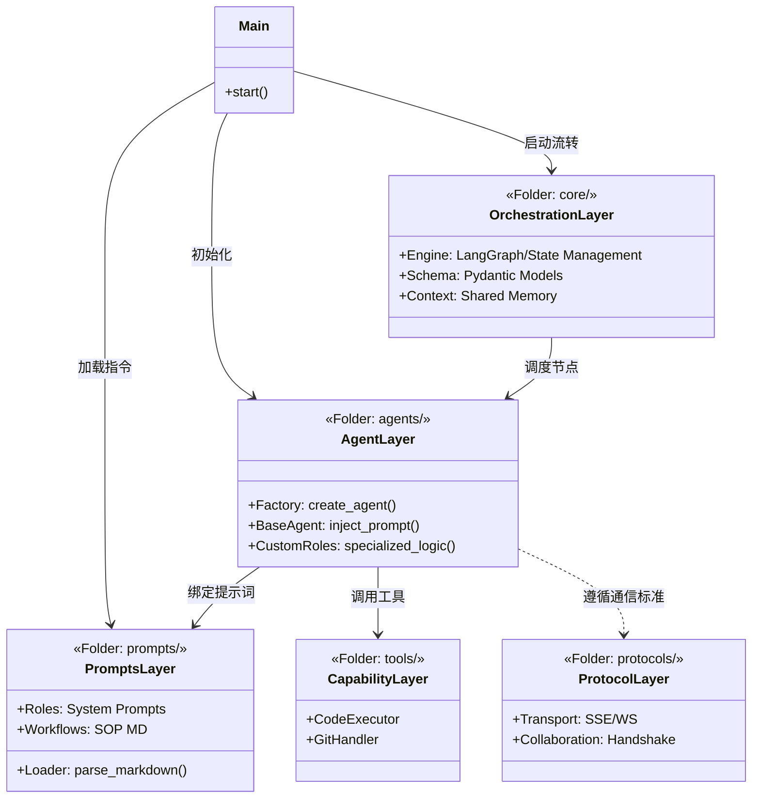

# 高效的多智能体（Multi-Agent）协同工程

1. 智能体定义与编排 (Orchestration)
角色定义 (Role Definition)：为每个 Agent 设置明确的 System Prompt（系统提示词），规定其职责（如“代码编写者”、“测试专家”、“架构评审员”）及输出格式。
拓扑结构管理 (Workflow Control)：定义 Agent 之间的协作模式，例如：
主从模式 (Supervisor)：由一个主 Agent 分配任务给子 Agent。
流水线模式 (Pipeline)：前一个 Agent 的输出作为下一个的输入。
群聊模式 (Group Chat)：多个 Agent 根据需求自主发言，适合开放式复杂任务。 
CSDN
CSDN
 +3
2. 通信与消息总线 (Communication Layer)
统一协议 (Messaging Protocol)：Agent 之间需要标准的消息传递格式（如 JSON），以确保信息交换的结构化。
上下文共享 (State Management)：多步对话中需要维护一份“共享状态”，让所有参与协作的 Agent 都能感知任务的最新进度。 
CSDN
CSDN
3. 工具层与执行环境 (Tooling & Environment)
标准化工具接口 (Tool Layer)：提供统一的函数调用（Function Calling）框架，让 Agent 能通过接口调用外部工具（如执行 Python 代码、搜索 GitHub 或读写数据库）。
安全沙箱 (Sandboxed Execution)：对于自动生成的代码，需要一个隔离的运行环境（Sandbox）来安全地执行和测试，防止损坏本地系统。 
火山引擎开发者社区
火山引擎开发者社区
 +2
4. 记忆管理 (Memory Layer)
短期记忆：记录当前会话的上下文，支撑即时的多轮对话。
长期记忆 (RAG)：通过向量数据库（Vector DB）存储历史知识、代码库或技术文档，让 Agent 具备跨项目的长效学习能力。 
CSDN
CSDN
 +1
5. 质量控制与反馈闭环 (Feedback Loop)
自我修正 (Self-Correction)：通过“执行-报错-重试”的循环，让 Agent 能在遇到错误（如语法错误或 Test 失败）后自动优化代码。
人工介入 (Human-in-the-Loop)：在关键环节（如部署或合并代码）设置人工确认接口，确保系统的可控性。 
AI编程社区
AI编程社区
 +1
6. 基础设施与监控 (Observability)
日志与追踪 (Tracing)：记录 Agent 的思考路径（Thought Process），方便开发者调试复杂的逻辑链。
成本与配额管理：监控 Token 消耗及 API 调用频率，防止因 Agent 陷入死循环导致的高昂费用。 
CSDN
CSDN
推荐参考框架：
Microsoft AutoGen：擅长复杂对话编排与代码自动执行。
LangGraph：适合构建具有循环逻辑的精细状态机系统。
CrewAI：侧重于角色扮演和基于任务的流水线协作。 
CSDN
CSDN
 +3
您是否希望针对具体的业务场景（如自动化测试或全栈代码开发）来细化这些功能的实现细节？

multi_agent_project/
├── .env                # 敏感信息 (API Keys, DB 密码)
├── .gitignore          # 忽略 venv, __pycache__, .env
├── main.py             # 入口：加载配置 -> 读取 md 提示词 -> 组装 Agent -> 启动
├── requirements.txt    # 依赖：langchain, langgraph, pydantic, pyyaml等
│
├── agents/             # 【1. 智能体逻辑层】(仅负责行为逻辑，不含指令内容)
│   ├── __init__.py
│   ├── factory.py      # 核心：解析 md 结构并映射到 Agent 实例的工厂类
│   ├── base_agent.py   # 抽象基类：定义通用的提示词注入与执行接口
│   └── custom_roles.py # 特定角色的特殊动作逻辑（如调用特定 Tool）
│
├── core/               # 【2. 状态与编排层】
│   ├── __init__.py
│   ├── engine.py       # 编排引擎：控制 Agent 间的跳转流转（State Machine）
│   ├── schema.py       # 统一 Pydantic 模型：定义消息、任务、状态
│   └── context.py      # 全局上下文管理：协调各个 Agent 的记忆读写
│
├── prompts/            # 【3. 指令资产层】(项目核心，全 md 化)
│   ├── __init__.py
│   ├── loader.py       # 工具：读取 md 文件，解析 Front-matter 元数据
│   ├── roles/          # 角色定义 (系统提示词)
│   │   ├── boss.md     # 管理员：任务拆解与分发逻辑
│   │   ├── coder.md    # 程序员：代码生成规范与技术栈限制
│   │   ├── reviewer.md # 审核员：Checklist 检查清单
│   │   └── tester.md   # 测试员：单元测试用例生成准则
│   ├── skills/         # 技能/工具描述 (供 Agent 理解如何使用 Tool)
│   │   ├── search.md   # 如何使用搜索引擎的指令
│   │   └── sandbox.md  # 在沙箱中执行代码的注意事项
│   └── workflows/      # 流程模板 (规定协作步骤)
│       ├── bug_fix.md  # 修复 Bug 的 SOP 流程说明
│       └── release.md  # 发布版本的协作流程说明
│
├── tools/              # 【4. 外部能力层】
│   ├── __init__.py
│   ├── code_executor.py# 安全沙箱封装 (Docker/Python-REPL)
│   ├── git_handler.py  # Git 交互操作
│   └── doc_parser.py   # 文档解析工具
│
├── memory/             # 【5. 记忆存储层】
│   ├── __init__.py
│   ├── vector_store.py # 长期记忆：RAG 向量检索
│   └── chat_history.py # 短期记忆：Redis/Sqlite 会话持久化
│
├── configs/            # 【6. 静态配置层】
│   ├── settings.py     # 环境参数加载
│   └── agents.yaml     # 映射表：定义哪个角色使用哪个 .md 文件及模型参数
│
├── logs/               # 【7. 监控与链路追踪】
│   ├── thoughts/       # 记录每个 Agent 的思维链 (Thought Chain)
│   └── usage.log       # 统计 Token 消耗与成本
│
├── tests/              # 测试验证
│    ├── test_prompt_loader.py # 验证 md 文件是否能被正确解析
│    └── test_workflow.py      # 验证多 Agent 链路是否畅通
│
└── protocols/
     ├── __init__.py
     ├── transport.py         # 传输层 (OpenAI SSE / WebSockets / JSON-RPC)
     ├── messaging.py         # 消息层 (OpenAI Chat Completion / ACP 安全报文)
     ├── collaboration.py     # 协同层 (A2A 握手协议 / Task Lifecycle 状态机)
     └── discovery.py         # 发现层 (Agent Card / ANP 注册表定义)

2. 文件夹及其文件功能详细清单
【1. 智能体逻辑层】 agents/
这是智能体的“躯干”，负责执行逻辑，但不存储具体的“灵魂”（提示词）。
factory.py: 根据配置文件（agents.yaml）将 Markdown 内容、模型参数和工具集动态组装成 LangChain/LangGraph 对象。
base_agent.py: 统一定义 Agent 的生命周期（初始化、接收消息、推理、工具调用、输出格式化）。
custom_roles.py: 存放非通用逻辑。例如：Coder 需要特殊处理文件写入冲突，Reviewer 需要触发特定的评分算法。
【2. 状态与编排层】 core/
系统的“中枢神经”，决定 Agent 之间如何协作。
engine.py: 基于 LangGraph 或自定义状态机。定义节点（Node）和边（Edge）的流转逻辑（如：Coder 失败 3 次后自动请求 Boss 介入）。
schema.py: 核心数据结构。定义 AgentState、Task、Message 等 Pydantic 模型，确保跨 Agent 传输的数据类型安全。
context.py: 管理“公共看板”。记录当前任务进度、共享变量，防止 Agent 在多轮对话中迷失方向。
【3. 指令资产层】 prompts/
系统的“知识库与灵魂”，将复杂的 Prompt 工程与代码逻辑完全解耦。
loader.py: 核心解析器。识别 .md 顶部的 YAML Front-matter（如模型温度、所需工具、依赖角色），并将其转换为 Python 字典。
roles/: 存放角色说明书。通过 Markdown 的标题语法（# Role, ## Constraints）让提示词结构化，易于版本管理和人类阅读。
skills/: 工具的“说明书”。让 Agent 知道什么时候该用 search，以及 sandbox 的环境限制。
workflows/: 场景化的 SOP。将业务流程（如修复 Bug）写成文档，作为 Context 注入给编排引擎。
【4. 外部能力层】 tools/
智能体的“手脚”，负责与现实世界交互。
code_executor.py: 封装 Docker 或隔离的 Python 环境，防止生成的恶意代码破坏宿主机。
git_handler.py: 自动处理 clone, commit, pr 等操作，使 Agent 具备协作开发能力。
【5. 记忆存储层】 memory/
系统的“海马体”，解决长短期遗忘问题。
vector_store.py: RAG 实现。将旧项目经验、技术文档向量化，供 Agent 检索。
chat_history.py: 存储原始对话流，支持多 Session 管理，通常对接 Redis 或 Postgres。
【6. 静态配置层】 configs/
系统的“遗传基因”，控制运行参数。
agents.yaml: 路由表。定义 Coder 角色对应 coder.md 指令，使用 gpt-4o 模型，并挂载 git_handler 工具。
【7. 协议层】 protocols/
系统的“外交规则”，这是实现跨系统、多平台 Agent 通信的关键。
transport/: 定义数据怎么传（如流式输出 SSE）。
messaging/: 定义数据格式（如 OpenAI 的 JSON 格式或自定义的加密报文）。
collaboration/: 定义 Agent 之间的“社交礼仪”。例如：Agent A 向 Agent B 发起请求时需要带上哪些权限凭证。

总体架构 UML 类图

程序还是报错了，你看下什么问题

这是原来代码，我看你的代码还想不一样，你根据错误和以前代码修改以下
